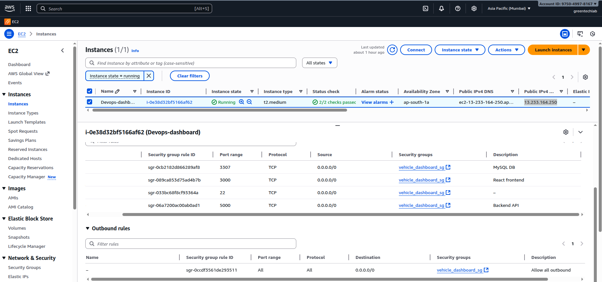
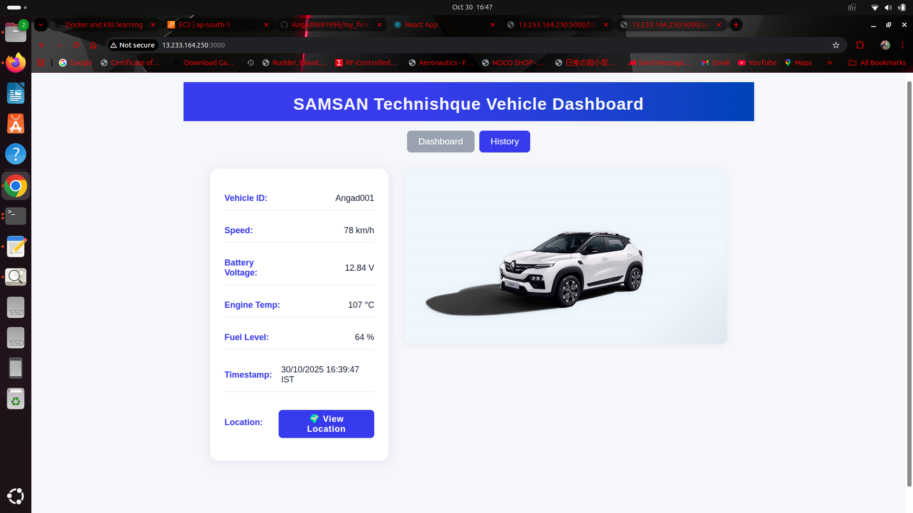
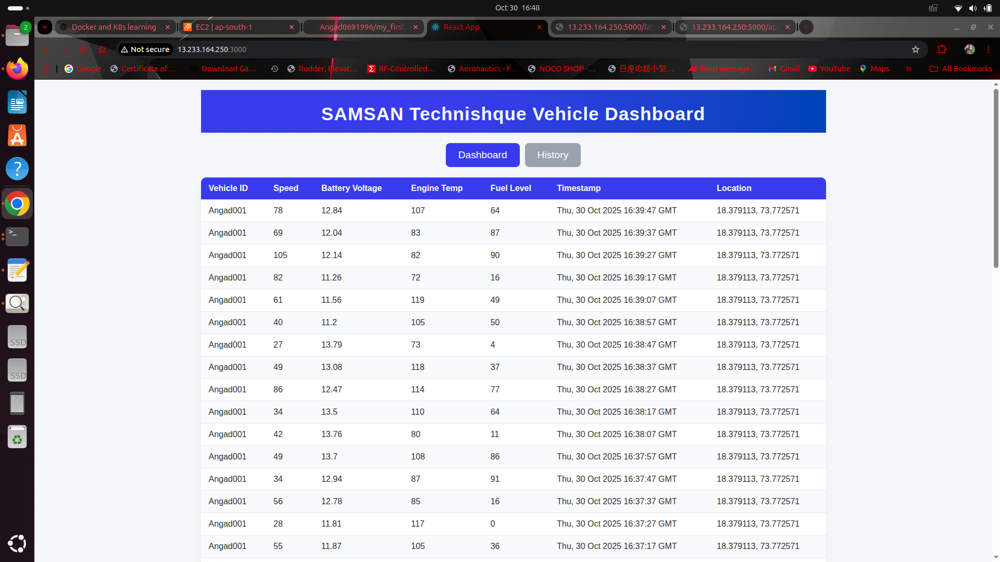
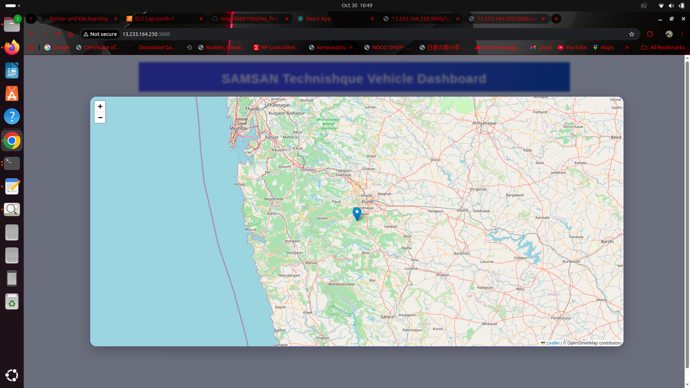

# 🚗 Vehicle Dashboard - Docker Compose on AWS EC2

A full-stack **IoT Vehicle Dashboard** deployed on an **AWS EC2 (t2.medium)** instance using **Docker Compose**.  
It integrates **Flask**, **React**, and **MySQL** containers to display live telemetry data from an MQTT-based vehicle publisher.

---

## ⚙️ Overview

| Component | Description | Port |
|------------|--------------|------|
| **MySQL (Database)** | Stores live vehicle telemetry data | 3307 |
| **Flask Backend (Subscriber)** | Receives MQTT messages and exposes `/latest` and `/api/logs` APIs | 5000 |
| **React Frontend (Dashboard)** | Visualizes live vehicle data from the backend | 3000 |

---

## 🧩 EC2 Configuration

| Parameter | Value |
|------------|--------|
| **AMI** | Canonical Ubuntu 24.04 (ami-02d26659fd82cf299) |
| **Instance Type** | t2.medium |
| **Storage** | 10 GiB |
| **Security Group** | Ports 22 (SSH), 3000 (React), 5000 (Flask), 3307 (MySQL) open |

---

## 🗂️ Project Structure

```
my_first_vehicle_dashboard/
├── backend/                     # Flask MQTT Subscriber
├── src/                         # React Frontend
├── Docs/
│   ├── EC2_Docker_Compose_Infrastructure.md
│   └── EC2_Docker_Compose_Infrastructure.pdf
├── assets/
│   ├── AWS_VM.png
│   ├── AWS-dashboard-1.png
│   ├── AWS-dashboard-2.png
│   └── AWS-dashboard-3.png
├── docker-compose.prod.yml      # Docker Compose configuration
├── .env                         # Environment variables
└── README.md
```

---

## 🐳 Docker Containers on EC2

```bash
$ docker ps
CONTAINER ID   IMAGE                                COMMAND                  STATUS          PORTS
99f378786ded   angad696/react-dashboard:latest      "/docker-entrypoint.…"   Up 14 mins      0.0.0.0:3000->80/tcp
3964b47e2c96   angad696/backend-subscriber:latest   "python subscriber.py"   Up 36 mins      0.0.0.0:5000->5000/tcp
dba706bcfd63   mysql:8.0                            "docker-entrypoint.s…"   Up 36 mins      0.0.0.0:3307->3306/tcp
```

---

## 🌍 Access Points

| Component | URL |
|------------|------|
| **React Dashboard** | [http://<EC2_PUBLIC_IP>:3000](http://<EC2_PUBLIC_IP>:3000) |
| **Flask Backend API** | [http://<EC2_PUBLIC_IP>:5000/latest](http://<EC2_PUBLIC_IP>:5000/latest) |

---

## Basic Docker Networking Diagram for this Project
                [ External User / Client ]       
                          |                   
         +----------------+--------------------+
         |                                     |
   (EC2 Public IP, Port 3000)           (EC2 Public IP, Port 5000)
         |                                     |
 +-------------------+                +-----------------------+
 |  React Frontend   |--HTTP REST API--| Flask Backend        |
 |  Container        |                | Subscriber Container  |
 +-------------------+                +-----------------------+
                                          |
                                          | SQL queries
                                     +-----------------+
                                     | MySQL Database  |
                                     | Container       |
                                     +-----------------+
## Communication Flow
External users load the React dashboard (http://EC2_PUBLIC_IP:3000).

React makes API calls to the Flask backend (http://EC2_PUBLIC_IP:5000/latest).

Flask API logic fetches data by querying the MySQL database (mysql-db).

Data flows back: Database → Backend → Frontend → User.


## 📸 Screenshots

### 🖥️ AWS VM & Dashboard View

| AWS VM | Dashboard |
|--------|------------|
|  |  |

### 📊 Additional Views



---

## 🧰 How to Deploy on AWS EC2

1. **Launch EC2 Instance**
   ```bash
   Instance Type: t2.medium
   AMI: Ubuntu 24.04 LTS
   ```

2. **Install Docker & Docker Compose**
   ```bash
   sudo apt update -y
   sudo apt install docker.io docker-compose -y
   sudo usermod -aG docker $USER
   newgrp docker
   ```

3. **Clone the Repository**
   ```bash
   git clone -b feature/docker-compose-aws https://github.com/Angad0691996/my_first_vehicle_dashboard.git
   cd my_first_vehicle_dashboard
   ```

4. **Run with Docker Compose**
   ```bash
   docker-compose -f docker-compose.prod.yml up -d
   #Since my EC2 has no elastic ip, i update my ec2 public ip in .env here "REACT_APP_BACKEND_URL=http://<latest ec2 ip>:5000" and rebuild the react container 

   ```

5. **Verify Containers**
   ```bash
   docker ps
   ```

6. **Access**
   - React Dashboard → `http://<EC2_PUBLIC_IP>:3000`
   - Flask Backend → `http://<EC2_PUBLIC_IP>:5000/latest`

7. **Re-deploy after EC2 ON/OFF**
   🔥 Next Time You Start EC2
   
    Just do:

    Update .env → change the IP

    Run the below 3 commands

    # Step 1 — Build frontend with NEW backend IP
    docker build -t angad696/react-dashboard:latest \
     --build-arg REACT_APP_BACKEND_URL=http://<NEW_PUBLIC_IP>:5000 .

    # Step 2 — Push new image to Docker Hub
    docker push angad696/react-dashboard:latest

    # Step 3 — Restart production stack
    docker compose -f docker-compose.prod.yml down
    docker compose -f docker-compose.prod.yml up -d

---

##Networking
                [ External User / Client ]       
                          |                   
         +----------------+--------------------+
         |                                     |
   (EC2 Public IP, Port 3000)           (EC2 Public IP, Port 5000)
         |                                     |
 +-------------------+                +-----------------------+
 |  React Frontend   |--HTTP REST API--| Flask Backend        |
 |  Container        |                | Subscriber Container  |
 +-------------------+                +-----------------------+
                                          |
                                          | SQL queries
                                     +-----------------+
                                     | MySQL Database  |
                                     | Container       |
                                     +-----------------+

###Communication Flow
External users load the React dashboard (http://EC2_PUBLIC_IP:3000).

React makes API calls to the Flask backend (http://EC2_PUBLIC_IP:5000/latest).

Flask API logic fetches data by querying the MySQL database (mysql-db).

Data flows back: Database → Backend → Frontend → User.

## 📄 Documentation
 
📗 [EC2 Docker Compose Infrastructure (.pdf)](EC2_Docker_Compose_Infrastructure.pdf)

---

## 🌿 Git Branch

This EC2-based deployment is maintained in the branch:  
**`feature/docker-compose-aws`**

---

# ⚡ Handling Dynamic IP Changes (Frontend Deployment)

Since the React frontend is built with the backend URL **hardcoded**, and the EC2 instance uses a **dynamic public IP** (no Elastic IP), the frontend must be **rebuilt and redeployed** every time the EC2 public IP changes.  

To simplify this, we use a helper script:  
`redeploy_frontend.sh` — which automates the entire multi-step process.

---

## 🧩 Execution Steps

**1. Grant Execution Permission**
```bash
chmod +x redeploy_frontend.sh
```

**2. Run the Deployment Script**  
The script will prompt you to enter the latest EC2 public IP.
```bash
./redeploy_frontend.sh
```

---

## ⚙️ Script Automation Workflow

The script automatically performs the following actions:

1. Updates the `REACT_APP_BACKEND_URL` value inside the `.env` file.  
2. Rebuilds the **React dashboard Docker image** locally (embedding the new backend IP).  
3. Pushes the newly built image to **Docker Hub**.  
4. Pulls and restarts the **react-dashboard** service using `docker-compose`.

---

## 🧾 Verification

Check all running containers:
```bash
docker ps
```

---

## 🌐 Access URLs

- **React Dashboard:**  
  `http://<EC2_PUBLIC_IP>:3000`  

- **Flask Backend:**  
  `http://<EC2_PUBLIC_IP>:5000/latest`

## 🧠 Summary

- End-to-end IoT data pipeline using Flask, React & MySQL  
- Data published via MQTT is displayed live on the dashboard  
- Fully containerized stack deployed on AWS EC2  
- Easy migration path to Kubernetes for production-grade scaling  

---

**Author:** Angad B.  
**Location:** Pune, India  
**Date:** October 2025  
