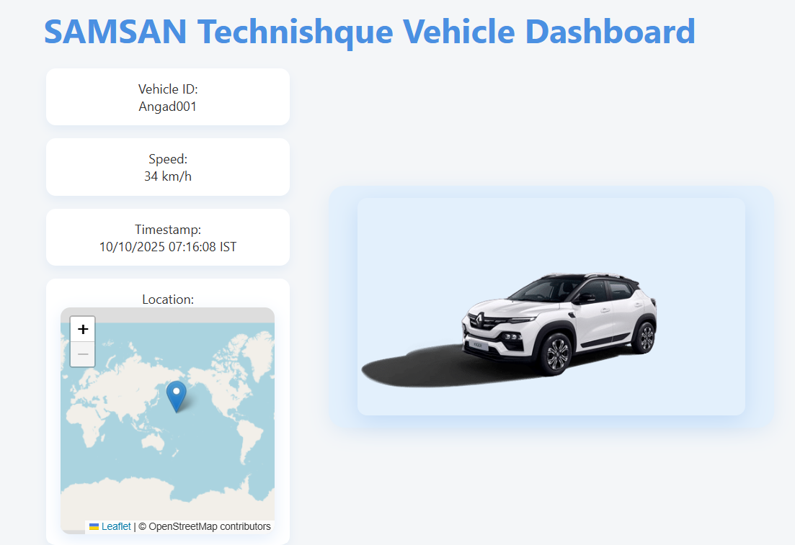

# 🚘 SAMSAN Technishque Vehicle Dashboard

A **real-time IoT-based Vehicle Dashboard** that visualizes live telemetry data such as **speed, location, and timestamp** — powered by **AWS IoT Core**, **Flask (Python)** backend, and a **React frontend**.

---

## 🧩 Project Overview

This project demonstrates an end-to-end **IoT → Cloud → Visualization** system.  
A connected vehicle sends telemetry data (speed, timestamp, location, etc.) to **AWS IoT Core**.  
A **Flask backend** processes this data and serves it to a **React-based dashboard** for visualization.

---

## 🏗️ Architecture

[Vehicle Sensor / IoT Device]
↓ (MQTT)
[AWS IoT Core]
↓
[Flask Backend API]
↓ (REST / SocketIO)
[React Frontend Dashboard]

---

## ⚙️ Tech Stack

| Layer | Technology | Description |
|-------|-------------|--------------|
| **Frontend** | React.js | Real-time vehicle dashboard visualization |
| **Backend** | Flask (Python) | REST API / WebSocket data streaming |
| **IoT Platform** | AWS IoT Core | MQTT broker for vehicle telemetry |
| **Map Integration** | Leaflet | Displays live vehicle location on map |

---

## 🚀 Features

- 📡 Real-time vehicle speed and location tracking  
- 🕒 Timestamped telemetry display  
- 🗺️ Interactive map using **Leaflet**  
- 🔒 Secure MQTT connection to **AWS IoT Core**  
- 💻 Modern and responsive React UI  
- ⚡ Lightweight Flask API backend  

---

## 🧠 How It Works

1. **IoT Device / Publisher**  
   Sends vehicle telemetry (`vehicle_id`, `speed`, `timestamp`, `latitude`, `longitude`) to AWS IoT Core using MQTT.

2. **AWS IoT Core**  
   Acts as a message broker, securely forwarding IoT data to the backend.

3. **Flask Backend**  
   Processes data and serves it via REST or WebSocket API to the frontend.

4. **React Frontend**  
   Displays real-time updates such as speed, timestamp, and vehicle location.

👨‍💻 Author
Angad
Cloud, IoT & Python Engineer
📍 Pune, India
