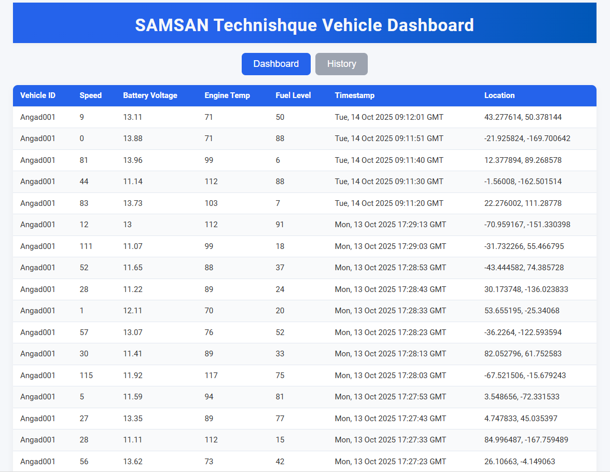
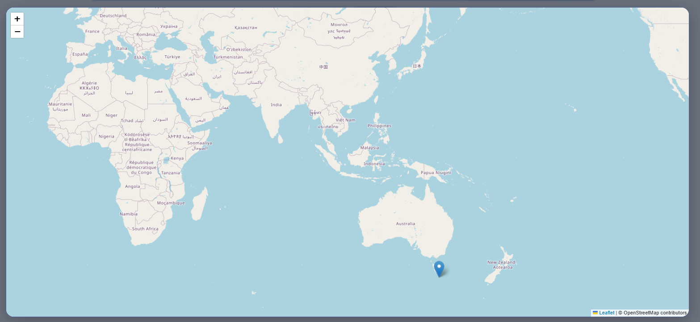
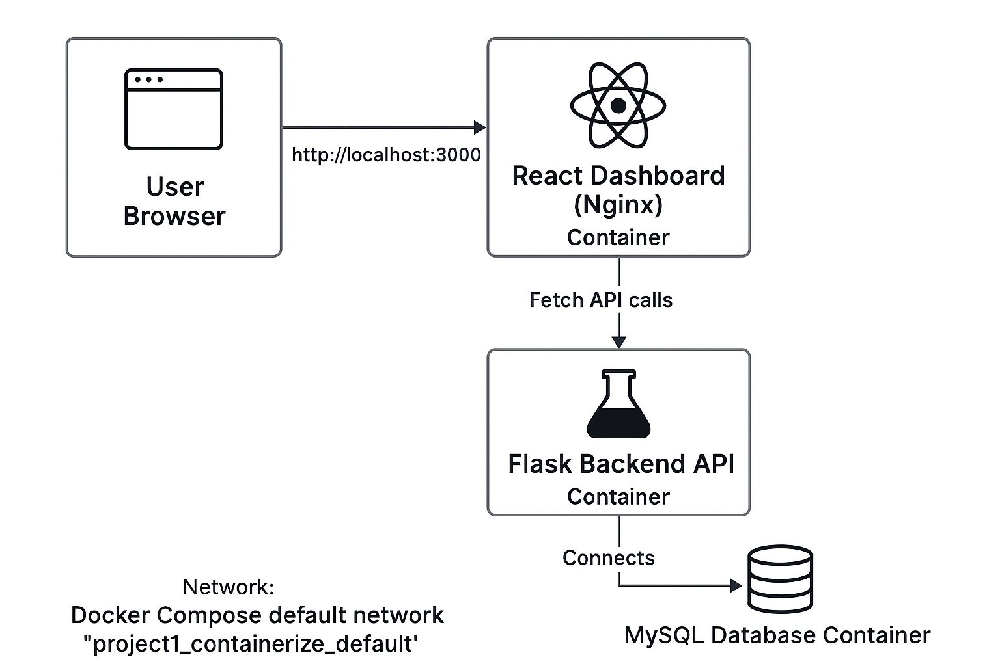

# ok, lets make a proper readme with this info with proper commands "PS D:\Full_Stack\DevOps_practices\project1_containerize\assets> docker ps

CONTAINER ID   IMAGE                                      COMMAND                  CREATED             STATUS             PORTS                                         NAMES
607e0d2d120f   project1_containerize-react-dashboard      "/docker-entrypoint.…"   36 minutes ago      Up 36 minutes      0.0.0.0:3000->80/tcp, [::]:3000->80/tcp       react-dashboard
f121f82853aa   project1_containerize-backend-subscriber   "python subscriber.py"   About an hour ago   Up 28 minutes      0.0.0.0:5000->5000/tcp, [::]:5000->5000/tcp   backend-subscriber
7affb566316e   mysql:8.0                                  "docker-entrypoint.s…"   About an hour ago   Up About an hour   0.0.0.0:3307->3306/tcp, [::]:3307->3306/tcp   project1_containerize-mysql-db-1" and here is are the images "PS D:\Full_Stack\DevOps_practices\project1_containerize\assets> ls

    Directory: D:\Full_Stack\DevOps_practices\project1_containerize\assets
    Mode                 LastWriteTime         Length Name
---------------------------
-a----        14-10-2025     09:11         193656 dashboard-preview.png
-a----        14-10-2025     09:12         177401 dashboard-tab2-history.png
-a----        14-10-2025     09:14         270703 location.png
-a----        25-10-2025     11:56        1043432 Web App Architecture Flowchart.png"

Here's a well-structured README template for your project including the Docker container details, commands, and images you provided. You can save this as `README.md` in your repo root.

```markdown
# Vehicle Dashboard - Containerized DevOps Architecture

A full-stack vehicle telemetry dashboard application demonstrating a DevOps architecture with multi-container Docker orchestration. Includes a React frontend, Flask backend subscriber, and MySQL database running as individual containers.

---

## Running Containers

Below are the containers currently running for this project:

| Container Name              | Image                             | Status       | Ports                  |
|-----------------------------|----------------------------------|--------------|------------------------|
| react-dashboard            | project1_containerize-react-dashboard    | Up 36 minutes | 0.0.0.0:3000->80/tcp   |
| backend-subscriber         | project1_containerize-backend-subscriber | Up 28 minutes | 0.0.0.0:5000->5000/tcp |
| project1_containerize-mysql-db-1 | mysql:8.0                        | Up About 1 hour | 0.0.0.0:3307->3306/tcp |

---

## Images in `assets/` Folder

- `dashboard-preview.png` — Preview of main vehicle dashboard UI  
- `dashboard-tab2-history.png` — Vehicle History tab UI screenshot  
- `location.png` — Location map snapshot used in the app  
- `Web App Architecture Flowchart.png` — Architecture flowchart depicting container communication and data flow

---

## Prerequisites

- Docker and Docker Compose installed (Docker Desktop recommended)
- Git installed for version control and collaboration

---

## Getting Started

### Clone the repo

```

git clone https://github.com/Angad0691996/my_first_vehicle_dashboard.git
cd my_first_vehicle_dashboard

```

### Start containers

```

docker-compose up -d

```

### Check running containers

```

docker ps

```

Expected output will be similar to the table above showing frontend, backend, and MySQL containers with their ports.

---

## Database Initialization

If running for the first time, create the MySQL table `vehicle_logs` inside the `vehicle_dashboard` database:

```

CREATE TABLE vehicle_logs (
  id INT AUTO_INCREMENT PRIMARY KEY,
  vehicle_ID VARCHAR(50),
  Speed FLOAT,
  Battery_voltage FLOAT,
  Engine_Temp FLOAT,
  Fuel_Level FLOAT,
  timestamp DATETIME,
  location VARCHAR(100)
);

```

You can connect to MySQL container and execute this command manually or automate with init scripts.

---

## Development and Deployment

- Modify React frontend in the `react-dashboard` folder. Rebuild Docker image after changes.
- Modify Flask backend subscriber code in `backend-subscriber`. Rebuild image and restart container after changes.
- Use `.env` file to configure database credentials and backend URLs.
- Use Git branches for collaboration, e.g., `feature/devops-architecture-setup`.

---

## Git Workflow

Create branches for features or fixes:

```

git checkout -b feature/devops-architecture-setup

```

Commit and push:

```

git add .
git commit -m "Your commit message"
git push -u origin feature/devops-architecture-setup

```

Create a Pull Request on GitHub for code review and merging.

---

## Screenshots

  
  
  


---

## Summary

This project demonstrates:

- Containerized microservices for frontend, backend, and DB.
- MQTT-based telemetry ingestion and storage.
- React UI showing live and historical vehicle data.
- Basic DevOps pipeline principles with Docker, Git, and CI/CD integration.

---

Feel free to contribute, report issues, or request features!

---

[License Info if any]
```

This will provide a clear, professional README for users and collaborators to understand setup, architecture, and workflow.

If you want, I can assist with creating this file in your repo and pushing the change!
<span style="display:none">[^1][^10][^2][^3][^4][^5][^6][^7][^8][^9]</span>

<div align="center">⁂</div>

[^1]: https://www.docker.com/blog/readmeai-an-ai-powered-readme-generator-for-developers/

[^2]: https://build.opensuse.org/projects/home:p0lip0:branches:openSUSE:Templates:Images:Tumbleweed/packages/dockerfile-application-container/files/README?expand=0

[^3]: https://devcontainers.github.io/implementors/templates-distribution/

[^4]: https://stackoverflow.com/questions/29134275/how-to-push-a-docker-image-with-readme-file-to-docker-hub

[^5]: https://docs.docker.com/get-started/workshop/02_our_app/

[^6]: https://gist.github.com/PurpleBooth/ea518ae68a49029bae95

[^7]: https://gitlab.cs.umd.edu/mmarsh/docker-tutorial/-/blob/master/README.md

[^8]: https://docs.docker.com/guides/python/containerize/

[^9]: https://www.reddit.com/r/docker/comments/4ol8xf/should_documentation_be_an_integral_part_of_a/

[^10]: https://forums.foundationdb.org/t/dockerized-deployment/1561

